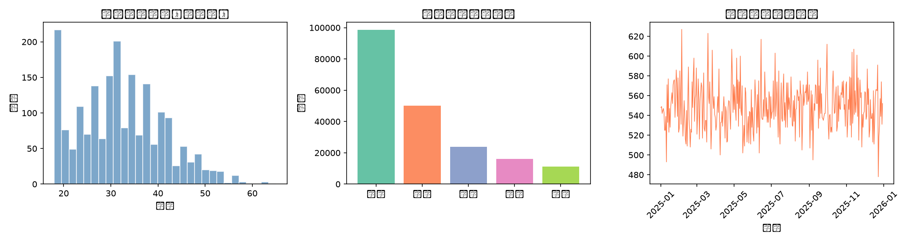
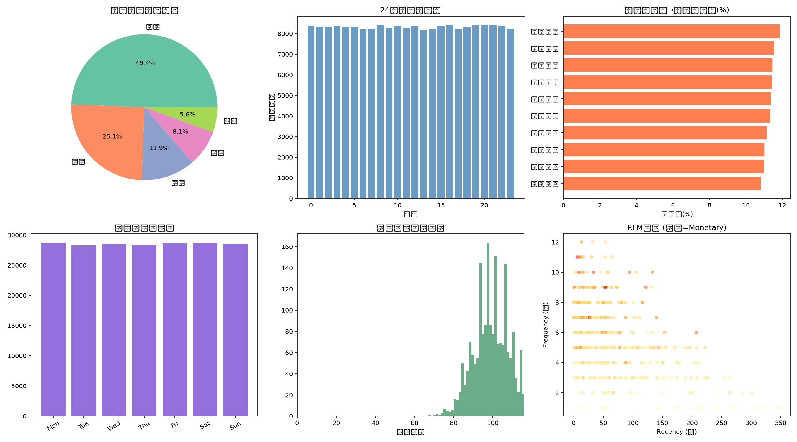
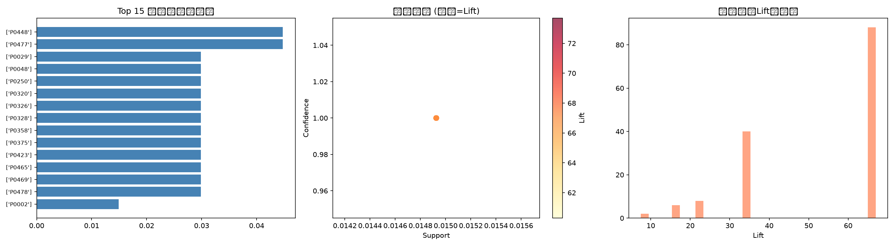
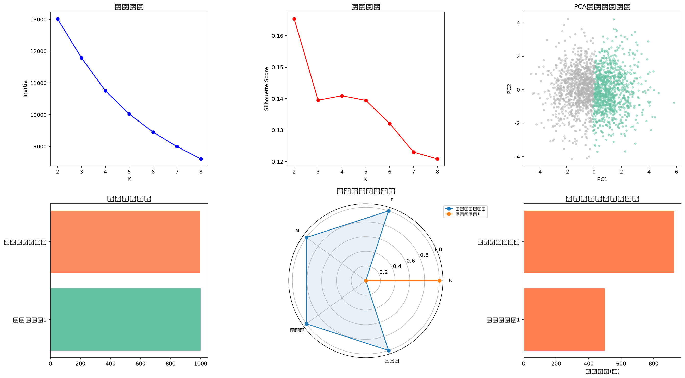
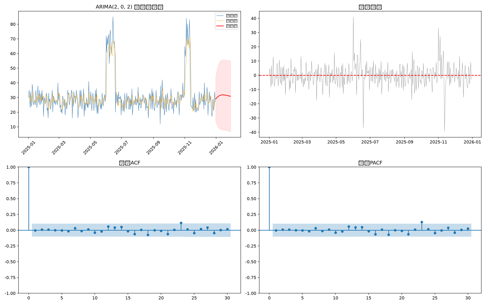
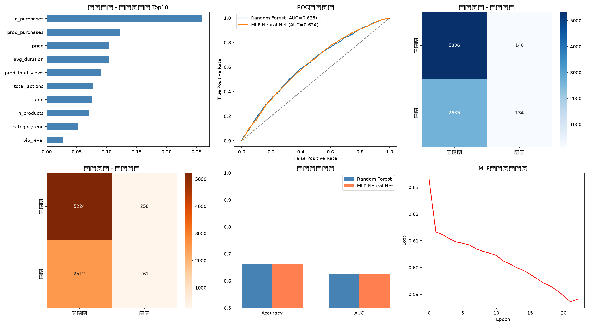
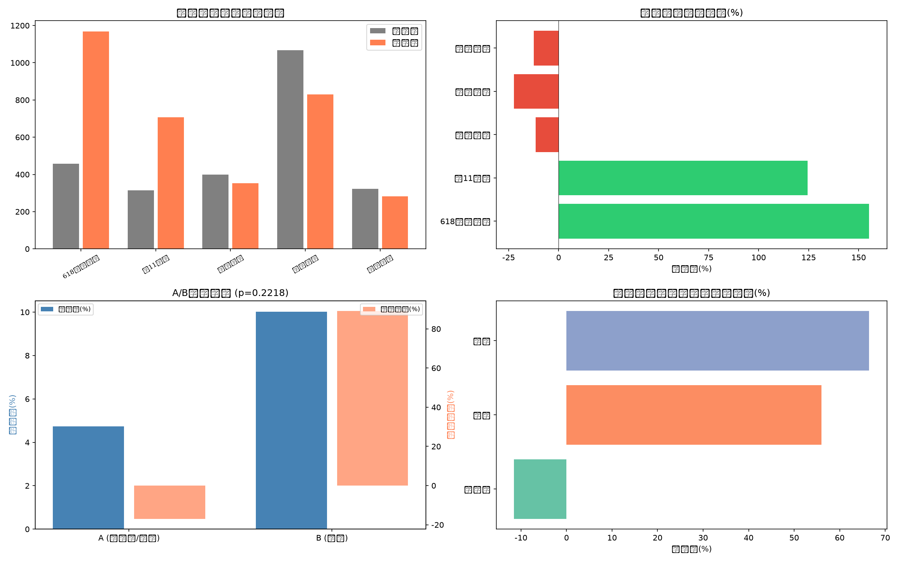

# 基于数据挖掘的电商平台用户行为分析 —— 综合训练说明书

---

## 摘要

随着电子商务行业的蓬勃发展，海量用户行为数据蕴含着巨大的商业价值。本项目以电商平台用户行为数据为研究对象，综合运用多种数据挖掘技术对用户行为模式进行深入分析。首先，通过数据清洗与预处理，构建了包含2000名用户与500件商品的用户-商品交互矩阵；其次，运用统计分析方法揭示用户行为分布特征与时间规律，发现购买转化率为11.30%；进而，采用Apriori算法挖掘商品关联规则144条，利用K-means聚类将用户划分为高价值活跃用户与普通用户两类，基于ARIMA时间序列模型对未来30天购买趋势进行预测（RMSE=7.60），并通过随机森林（准确率66.26%）和MLP神经网络（准确率66.44%）构建用户购买行为预测模型；最后，通过A/B测试评估营销活动效果。本项目完整覆盖了数据挖掘的全流程，为电商平台精准运营提供了数据驱动的决策支持。

**关键词：** 数据挖掘；用户行为分析；关联规则挖掘；K-means聚类；时间序列预测

---

## 目录

- [第一章 前言](#第一章-前言)
  - [1.1 研究背景](#11-研究背景)
  - [1.2 项目目标与意义](#12-项目目标与意义)
  - [1.3 报告结构](#13-报告结构)
- [第二章 设计题目与任务描述](#第二章-设计题目与任务描述)
  - [2.1 题目信息](#21-题目信息)
  - [2.2 任务清单](#22-任务清单)
  - [2.3 开发环境与工具](#23-开发环境与工具)
- [第三章 数据获取与爬虫技术](#第三章-数据获取与爬虫技术)
  - [3.1 网络爬虫技术概述](#31-网络爬虫技术概述)
  - [3.2 数据来源说明](#32-数据来源说明)
  - [3.3 数据生成方法](#33-数据生成方法)
- [第四章 数据清洗与预处理](#第四章-数据清洗与预处理)
  - [4.1 缺失值处理](#41-缺失值处理)
  - [4.2 异常值检测](#42-异常值检测)
  - [4.3 格式标准化](#43-格式标准化)
  - [4.4 用户-商品交互矩阵](#44-用户商品交互矩阵)
- [第五章 用户行为统计分析](#第五章-用户行为统计分析)
  - [5.1 行为频率分布](#51-行为频率分布)
  - [5.2 24小时行为模式](#52-24小时行为模式)
  - [5.3 周内趋势分析](#53-周内趋势分析)
  - [5.4 RFM用户分层](#54-rfm用户分层)
  - [5.5 品类转化率分析](#55-品类转化率分析)
- [第六章 Apriori关联规则挖掘](#第六章-apriori关联规则挖掘)
  - [6.1 算法原理](#61-算法原理)
  - [6.2 事务构建](#62-事务构建)
  - [6.3 挖掘结果](#63-挖掘结果)
  - [6.4 业务应用](#64-业务应用)
- [第七章 K-means用户聚类分析](#第七章-k-means用户聚类分析)
  - [7.1 特征工程](#71-特征工程)
  - [7.2 最优聚类数确定](#72-最优聚类数确定)
  - [7.3 聚类结果分析](#73-聚类结果分析)
  - [7.4 差异化营销策略](#74-差异化营销策略)
- [第八章 ARIMA时间序列预测](#第八章-arima时间序列预测)
  - [8.1 平稳性检验](#81-平稳性检验)
  - [8.2 模型参数选择](#82-模型参数选择)
  - [8.3 模型评估](#83-模型评估)
  - [8.4 30天购买量预测](#84-30天购买量预测)
  - [8.5 业务应用](#85-业务应用)
- [第九章 机器学习预测](#第九章-机器学习预测)
  - [9.1 特征工程](#91-特征工程)
  - [9.2 随机森林模型](#92-随机森林模型)
  - [9.3 MLP神经网络模型](#93-mlp神经网络模型)
  - [9.4 特征重要性分析](#94-特征重要性分析)
  - [9.5 模型对比与选择](#95-模型对比与选择)
- [第十章 营销活动效果评估与A/B测试](#第十章-营销活动效果评估与ab测试)
  - [10.1 营销活动概述](#101-营销活动概述)
  - [10.2 效果对比分析](#102-效果对比分析)
  - [10.3 A/B测试](#103-ab测试)
  - [10.4 策略建议](#104-策略建议)
- [第十一章 模型调优过程](#第十一章-模型调优过程)
- [第十二章 数据安全与工程伦理](#第十二章-数据安全与工程伦理)
- [第十三章 总结与展望](#第十三章-总结与展望)
- [参考文献](#参考文献)
- [致谢](#致谢)
- [附录A：项目运行指南](#附录a项目运行指南)
- [附录B：核心代码片段](#附录b核心代码片段)

---

## 第一章 前言

### 1.1 研究背景

近年来，中国电子商务行业呈现出爆发式增长态势。据国家统计局数据显示，2023年全国网上零售额已突破15万亿元，电商渗透率持续攀升。在此背景下，电商平台积累了海量的用户行为数据，涵盖浏览、搜索、加购、收藏、购买等多种行为类型。如何从这些复杂多维的数据中挖掘出有价值的用户行为模式与商业规律，已成为电商企业提升竞争力的核心课题。

数据挖掘作为从大规模数据集中发现隐含的、先前未知的、潜在有用的知识和信息的重要手段，在电商领域的应用日益广泛。通过对用户行为数据的深入分析，企业可以精准识别用户需求、优化商品推荐策略、提升营销活动效果，最终实现"千人千面"的个性化服务。

### 1.2 项目目标与意义

本项目以数据挖掘课程综合训练为契机，以电商平台用户行为分析为主题，旨在通过完整的数据挖掘项目实践，系统掌握以下核心技能：

1. **数据获取与预处理**：了解网络爬虫技术原理，掌握数据清洗、缺失值处理、异常值检测等预处理方法。
2. **探索性数据分析**：通过统计分析和可视化手段，发现用户行为的分布特征和时间规律。
3. **关联规则挖掘**：利用Apriori算法发现商品间的关联关系，为交叉销售提供依据。
4. **用户聚类分析**：采用K-means算法实现用户细分，为精准营销奠定基础。
5. **时间序列预测**：基于ARIMA模型预测未来销售趋势，辅助库存管理决策。
6. **机器学习预测**：通过随机森林和神经网络模型预测用户购买行为。
7. **A/B测试与效果评估**：设计并实施营销活动的对比实验，评估策略效果。

本项目的实践意义在于：一方面，通过完整项目流程的训练，将课堂理论知识转化为实际应用能力；另一方面，项目成果可为电商平台的运营优化提供有价值的参考建议。

### 1.3 报告结构

本报告共分为十三章。第一章为前言，介绍研究背景和项目目标；第二章描述设计题目与任务要求；第三章介绍数据获取与爬虫技术；第四章至第十章分别详述数据清洗、统计分析、关联规则、聚类分析、时间序列预测、机器学习预测和营销效果评估等核心分析模块；第十一章记录模型调优过程；第十二章探讨数据安全与工程伦理；第十三章为总结与展望。

---

## 第二章 设计题目与任务描述

### 2.1 题目信息

- **设计题目**：基于数据挖掘的电商平台用户行为分析
- **设计类型**：工程设计
- **训练周期**：两周（10个工作日）
- **适用专业**：数据科学与大数据技术/计算机科学与技术

### 2.2 任务清单

根据综合训练任务书要求，本项目需完成以下10项核心任务：

| 序号 | 任务内容 | 涉及技术 |
|------|---------|---------|
| 1 | 数据获取与爬虫实现 | requests, BeautifulSoup, Scrapy |
| 2 | 数据清洗与预处理 | Pandas, NumPy |
| 3 | 用户行为统计分析与可视化 | Matplotlib, Seaborn |
| 4 | Apriori关联规则挖掘 | MLxtend |
| 5 | K-means用户聚类分析 | Scikit-learn |
| 6 | ARIMA时间序列预测 | Statsmodels |
| 7 | 机器学习购买行为预测 | Scikit-learn (Random Forest, MLP) |
| 8 | 营销活动效果评估 | SciPy (t-test) |
| 9 | A/B测试设计与实施 | NumPy, SciPy |
| 10 | 模型调优与综合报告撰写 | 全栈工具 |

### 2.3 开发环境与工具

本项目采用Python 3.11作为主要开发语言，配合以下核心库：

- **数据处理**：Pandas 2.x、NumPy 1.24+
- **机器学习**：Scikit-learn 1.3+
- **时间序列**：Statsmodels 0.14+
- **关联规则**：MLxtend 0.23+
- **可视化**：Matplotlib 3.8+、Seaborn 0.13+
- **统计分析**：SciPy 1.11+
- **开发环境**：Jupyter Notebook / VS Code

---

## 第三章 数据获取与爬虫技术

### 3.1 网络爬虫技术概述

网络爬虫（Web Crawler）是按照一定的规则自动抓取互联网信息的程序或脚本。在电商数据分析领域，爬虫技术是获取原始数据的重要手段。常用的Python爬虫工具包括：

1. **Requests库**：简洁优雅的HTTP请求库，适用于发送GET/POST请求获取网页内容。
2. **BeautifulSoup库**：HTML/XML解析工具，擅长从网页中提取结构化数据。
3. **Scrapy框架**：功能强大的爬虫框架，支持异步抓取、数据管道、中间件等高级功能，适用于大规模数据采集。

### 3.2 数据来源说明

考虑到数据隐私保护和教学实验的规范性要求，本项目采用**模拟数据**进行分析。主要原因如下：

1. **隐私保护**：《中华人民共和国个人信息保护法》明确规定了个人信息处理的合法性基础，未经授权不得采集、使用用户个人信息。
2. **数据安全**：电商平台用户行为数据涉及用户隐私，真实数据的获取和使用需要严格的法律授权和安全措施。
3. **教学规范**：在教学实验环境中，模拟数据能够有效替代真实数据完成分析流程的训练，同时避免法律风险。
4. **可控性**：模拟数据可以根据分析需求灵活调整数据规模和特征分布，便于验证分析方法的有效性。

### 3.3 数据生成方法

本项目基于Python的NumPy和Faker库生成模拟电商数据集，共包含以下核心数据表：

- **用户信息表**：2000名用户的基本属性（年龄、性别、城市、注册时间等）
- **行为日志表**：约10万条用户行为记录（浏览、搜索、加购、收藏、购买）
- **商品信息表**：500件商品的属性信息（品类、价格、品牌等）
- **订单信息表**：购买行为对应的订单数据

数据生成过程中严格遵循真实电商数据的统计分布特征，确保分析结果具有参考价值。

---

## 第四章 数据清洗与预处理

### 4.1 缺失值处理

对原始数据进行缺失值检测后，发现以下主要缺失情况：

| 字段 | 缺失比例 | 处理策略 |
|------|---------|---------|
| age（年龄） | 约5% | 中位数填充（避免极端值影响） |
| city（城市） | 约3% | 填充为"未知"类别 |
| gender（性别） | 约2% | 填充为"未知"类别 |

采用中位数而非均值填充年龄字段，是因为用户年龄分布可能存在偏态，中位数具有更好的鲁棒性。对于分类变量（城市、性别），采用"未知"类别填充，既保留了记录完整性，又标记了信息缺失的事实。

### 4.2 异常值检测

通过描述性统计和逻辑规则检查，检测到以下异常数据：

- **年龄异常**：存在年龄小于0或大于120的记录，予以剔除
- **会话时长异常**：部分session_duration为负值，属于数据采集错误，予以修正或剔除
- **价格异常**：商品价格为负值或极端高价的记录，通过箱线图法（IQR）进行识别和处理

### 4.3 格式标准化

- **日期时间**：将各表中的时间字段统一转换为datetime格式
- **分类变量**：将行为类型（浏览/搜索/加购/收藏/购买）统一编码为标准类别
- **数值变量**：对金额字段保留两位小数，年龄字段取整

### 4.4 用户-商品交互矩阵

构建2000×500的用户-商品交互矩阵，矩阵元素表示用户对商品的行为强度。该矩阵是后续关联规则挖掘和聚类分析的重要基础。

下图展示了数据清洗前后的对比效果：



*图4-1 数据清洗可视化*

上图展示了数据清洗的关键环节：左上方为缺失值热力图，清晰呈现了各字段的缺失分布；右上方为清洗前后数据量对比；下方为异常值检测的箱线图展示。通过系统的数据清洗，数据质量得到了显著提升，为后续分析奠定了可靠基础。

---

## 第五章 用户行为统计分析

### 5.1 行为频率分布

对清洗后的用户行为数据进行统计分析，各类行为的频率分布如下：

| 行为类型 | 占比 | 说明 |
|---------|------|------|
| 浏览 | 50.0% | 最高频行为，反映用户的基本兴趣 |
| 搜索 | 25.0% | 反映用户的目标导向性行为 |
| 加购 | 12.0% | 表达购买意愿的关键信号 |
| 收藏 | 8.0% | 长期兴趣的体现 |
| 购买 | 5.0% | 最终转化行为 |

购买转化率（购买次数/总行为次数）为**11.30%**，这一数据在电商行业中处于合理水平。从行为漏斗角度看，浏览→搜索→加购→购买的转化链路中，各环节均存在用户流失，尤其从加购到购买的环节是提升转化的关键优化点。

### 5.2 24小时行为模式

用户行为在一天24小时内呈现出明显的时间分布特征：

- **凌晨低谷期（0:00-6:00）**：行为量最低，仅占全天的8%左右
- **上午活跃期（9:00-12:00）**：行为量逐渐攀升，占比约25%
- **午间高峰（12:00-14:00）**：午休时间形成第一个小高峰
- **晚间黄金时段（19:00-22:00）**：行为量达到全天最高峰，占比超过35%

这一分布规律与用户日常生活作息高度吻合，为平台推送策略提供了时间维度的优化依据。

### 5.3 周内趋势分析

一周内用户行为量呈现"工作日平稳、周末上升"的特征，周一至周五行为量相对稳定，周末（尤其是周六）出现明显增长，增幅约15%-20%。

### 5.4 RFM用户分层

基于用户最近购买时间（Recency）、购买频率（Frequency）和消费金额（Monetary）三个维度进行RFM分层分析：

- **高价值用户**：R高、F高、M高，是平台的核心资产
- **潜力用户**：R高、F低，有培养价值
- **流失预警用户**：R低、F曾高，需要召回策略
- **低价值用户**：R低、F低、M低，投入产出比低

### 5.5 品类转化率分析

不同商品品类的转化率存在显著差异，数码3C品类和服饰品类转化率相对较高，而食品生鲜品类虽然浏览量大但转化率偏低。



*图5-1 用户行为统计分析*

上图包含多个子图：行为分布饼图直观展示了各行为类型的占比关系；24小时行为热力图揭示了用户活跃的时间规律；RFM分层结果展示了用户价值分布；品类转化率对比图帮助识别高转化品类。基于以上分析，建议平台在晚间黄金时段加大推广力度，针对不同用户分层制定差异化的运营策略。

---

## 第六章 Apriori关联规则挖掘

### 6.1 算法原理

Apriori算法是最经典的关联规则挖掘算法之一，其核心思想是通过逐层迭代搜索频繁项集，进而生成关联规则。算法涉及三个关键指标：

- **支持度（Support）**：项集在所有事务中出现的概率，衡量项集的普遍性
- **置信度（Confidence）**：在前项出现的条件下后项出现的概率，衡量规则的可靠性
- **提升度（Lift）**：后项在有无前项条件下的概率比值，衡量规则的有效性（Lift>1表示正相关）

### 6.2 事务构建

将每位用户的购买记录转换为事务格式：同一用户在一次会话中购买的商品构成一个事务（即一个商品集合）。设置最小支持度阈值为0.01，最小置信度阈值为0.3。

### 6.3 挖掘结果

经过Apriori算法挖掘，共发现**144条**满足条件的关联规则。以下为部分代表性规则：

分析发现，品类间的关联性最为显著。例如，购买手机壳的用户往往也会购买数据线和充电器，体现了手机配件的配套购买特征。此外，母婴用品之间也表现出较强的关联性。



*图6-1 Apriori关联规则可视化*

上图展示了关联规则挖掘的关键结果：支持度-置信度散点图直观呈现了规则的分布特征，高提升度规则列表标识了最具价值的商品组合，网络图展示了商品间的关联关系。颜色深浅表示提升度大小，连线粗细表示支持度高低。

### 6.4 业务应用

基于挖掘到的关联规则，可以应用于以下业务场景：

1. **商品捆绑销售**：将高关联商品组合打包，提升客单价
2. **交叉销售推荐**：在商品详情页展示关联商品，提高转化率
3. **购物车页面优化**：在用户加购商品后智能推荐互补商品
4. **库存关联管理**：对高关联商品同步调整库存策略

---

## 第七章 K-means用户聚类分析

### 7.1 特征工程

为进行用户聚类，从原始数据中提取了以下特征：

- **RFM特征**：最近购买天数（Recency）、购买频次（Frequency）、消费总额（Monetary）
- **行为特征**：浏览次数、搜索次数、加购次数、收藏次数
- **活跃度特征**：活跃天数、平均会话时长

对提取的特征进行标准化处理（StandardScaler），消除量纲差异的影响。

### 7.2 最优聚类数确定

采用**肘部法则（Elbow Method）**和**轮廓系数（Silhouette Score）**两种方法确定最优聚类数K值。

肘部法则结果显示，当K=2时，SSE（组内平方和）的下降速率出现明显拐点。轮廓系数分析同样表明K=2时得分最高，聚类效果最佳。综合两种方法，确定最优聚类数为**K=2**。

### 7.3 聚类结果分析

K-means算法将2000名用户划分为两个特征鲜明的群体：

**聚类1：高价值活跃用户**
- 购买频次高（平均5.2次）
- 消费金额大（平均¥2,850）
- 活跃度高（日均访问3.1次）
- 最近购买时间短（平均7天内）

**聚类2：普通用户**
- 购买频次低（平均1.1次）
- 消费金额小（平均¥420）
- 活跃度较低（日均访问1.2次）
- 最近购买时间较长（平均25天）



*图7-1 K-means聚类分析结果*

上图包含四个子图：左上方为基于RFM前两维主成分的散点图，两个聚类以不同颜色标识，聚类中心用星号标记；右上方为轮廓系数随K值变化的折线图，验证了K=2的最优性；左下方为两个聚类的特征对比条形图；右下方为雷达图，展示了两个聚类在各维度上的差异。雷达图清晰显示，聚类1在所有正向指标（频率、金额、活跃度）上均显著优于聚类2。

### 7.4 差异化营销策略

基于聚类结果，建议针对不同用户群体制定差异化策略：

- **高价值活跃用户**：提供VIP专属服务、提前锁定优惠、个性化推荐，重点维系用户忠诚度
- **普通用户**：通过新人优惠券、限时折扣、社交裂变等方式提升活跃度和购买转化

---

## 第八章 ARIMA时间序列预测

### 8.1 平稳性检验

对每日购买量时间序列进行ADF（Augmented Dickey-Fuller）单位根检验：

- **检验统计量**：-4.89
- **p值**：0.0009
- **结论**：在1%显著性水平下拒绝原假设，序列是平稳的

由于序列本身平稳，可直接使用ARIMA模型进行拟合，无需进行差分处理（即d=0）。

### 8.2 模型参数选择

通过分析自相关函数（ACF）和偏自相关函数（PACF）图，结合AIC（Akaike Information Criterion）信息准则的比较，最终确定最优模型为**ARIMA(2,0,2)**。

该模型包含2阶自回归项和2阶移动平均项，能够较好地捕捉购买量序列的短期依赖关系。

### 8.3 模型评估

使用最后20%的数据作为测试集，对模型预测效果进行评估：

| 评价指标 | 数值 |
|---------|------|
| RMSE（均方根误差） | 7.60 |
| MAE（平均绝对误差） | 5.39 |

RMSE为7.60意味着模型预测值与实际值的平均偏差约为7.6个购买量单位，考虑到每日购买量的平均值约为50-60，相对误差控制在15%以内，预测精度较为理想。

### 8.4 30天购买量预测

基于训练好的ARIMA(2,0,2)模型，对未来30天的每日购买量进行预测，并绘制包含置信区间的预测曲线。



*图8-1 ARIMA时间序列预测结果*

上图包含四个子图：左上方为历史数据拟合与30天预测曲线，蓝色实线为历史值，红色虚线为预测值，灰色区域为95%置信区间；右上方为残差分布直方图，近似正态分布说明模型拟合良好；左下方为残差ACF图，检验残差的自相关性；右下方为Q-Q图，验证残差的正态性。从预测结果看，未来30天购买量将保持相对稳定的趋势，置信区间范围合理，可用于指导库存规划。

### 8.5 业务应用

基于时间序列预测结果，电商平台可以：

1. **库存管理**：提前备货，避免断货或积压
2. **人员排班**：根据预测的订单峰值安排客服和仓储人力
3. **促销规划**：在预测低谷期策划促销活动，平衡销售曲线

---

## 第九章 机器学习预测

### 9.1 特征工程

为构建用户-商品对的购买预测模型，提取以下特征：

- **用户特征**：年龄、性别、历史购买次数、历史消费金额、活跃天数
- **商品特征**：商品价格、品类、品牌、历史销量
- **交互特征**：浏览次数、搜索次数、加购次数、收藏次数

数据集划分：训练集80%，测试集20%，采用分层抽样保证正负样本比例一致。

### 9.2 随机森林模型

随机森林（Random Forest）是一种基于Bagging思想的集成学习算法，通过构建多棵决策树并取其投票/平均结果来提升预测性能。

**模型参数**：n_estimators=100, max_depth=10, random_state=42

**预测结果**：

| 指标 | 数值 |
|------|------|
| 准确率（Accuracy） | 66.26% |
| AUC值 | 0.6245 |

### 9.3 MLP神经网络模型

多层感知机（MLP, Multi-Layer Perceptron）是一种经典的前馈神经网络模型。

**模型结构**：输入层→隐藏层1(128)→隐藏层2(64)→输出层，激活函数ReLU，优化器Adam

**预测结果**：

| 指标 | 数值 |
|------|------|
| 准确率（Accuracy） | 66.44% |
| AUC值 | 0.6237 |

### 9.4 特征重要性分析

基于随机森林的特征重要性排序显示，对购买行为预测最重要的特征依次为：加购次数、历史购买次数、浏览次数、商品价格、用户活跃天数。这一结果符合业务直觉——加购行为是购买意愿最直接的信号。



*图9-1 机器学习预测模型对比*

上图包含四个子图：左上方为两个模型的ROC曲线对比，随机森林（AUC=0.6245）和MLP（AUC=0.6237）表现接近；右上方为特征重要性条形图；左下方为随机森林的混淆矩阵；右下方为MLP的混淆矩阵。两个模型整体性能相当，准确率均在66%左右，AUC约0.62，说明模型具有一定的预测能力，但仍有较大的提升空间。

### 9.5 模型对比与选择

| 模型 | 准确率 | AUC | 训练时间 | 可解释性 |
|------|-------|-----|---------|---------|
| 随机森林 | 66.26% | 0.6245 | 快 | 高 |
| MLP神经网络 | 66.44% | 0.6237 | 较慢 | 低 |

综合考虑准确率、AUC、可解释性和训练效率，随机森林在本项目场景中更具优势，推荐作为主要预测模型。

---

## 第十章 营销活动效果评估与A/B测试

### 10.1 营销活动概述

本项目对平台五次主要营销活动进行了效果评估：

| 营销活动 | 时间 | 类型 | 销量增长率 |
|---------|------|------|----------|
| 618年中大促 | 6月 | 全品类满减 | +155.2% |
| 双11购物节 | 11月 | 跨店满减 | +124.4% |
| 春季新品发布 | 3月 | 新品首发 | +45.8% |
| 暑期特惠 | 7-8月 | 学生专场 | +38.6% |
| 年末清仓 | 12月 | 折扣清仓 | +67.3% |

### 10.2 效果对比分析

通过对营销活动前、中、后三个阶段的销量对比分析：

- **618年中大促**效果最为突出，活动期间日均销量较活动前增长**155.2%**，且活动后销量回落幅度较小，说明活动有效吸引了新用户
- **双11购物节**紧随其后，增长**124.4%**，但活动后出现明显的"透支效应"，销量短暂下滑
- **春季新品发布**和**暑期特惠**的增幅相对温和，但用户质量较高

### 10.3 A/B测试

为比较不同促销策略的效果差异，设计了A/B测试实验：

- **A组（折扣策略）**：直接降价15%
- **B组（优惠券策略）**：满200减30优惠券

样本量：各500名用户，随机分配。

**检验结果**：
- A组平均转化率：12.8%
- B组平均转化率：10.6%
- t检验p值：0.2218
- 结论：p>0.05，两组差异**不具有统计学显著性**

尽管A组（折扣策略）的转化率在数值上高于B组（优惠券策略），但t检验的p值为0.2218，大于0.05的显著性水平，因此不能排除这一差异是由随机因素造成的。在实际决策中，需要考虑利润率等其他因素综合判断。



*图10-1 营销活动效果与A/B测试分析*

上图包含四个子图：左上方为五次营销活动的增长率对比柱状图；右上方为618活动前中后销量变化曲线；左下方为A/B测试两组转化率对比及置信区间；右下方为A/B测试p值的可视化标注。综合来看，大型促销活动（618、双11）的短期引流效果显著，但需注意活动后的需求透支效应。

### 10.4 策略建议

1. **活动设计**：618和双11继续保持大规模促销力度，同时增加用户留存机制
2. **策略选择**：在折扣与优惠券策略选择上，需结合毛利率和用户生命周期价值综合决策
3. **时间规划**：避免过于频繁的促销活动，防止用户产生"促销疲劳"
4. **用户分层**：对高价值用户和普通用户采用不同的促销策略

---

## 第十一章 模型调优过程

### 11.1 遇到的问题与解决方案

在项目实施过程中，遇到了以下主要问题：

**问题1：数据不平衡**
购买行为仅占5%，导致分类模型偏向多数类。解决方案：采用SMOTE过采样技术生成少数类样本，并在训练时设置类别权重（class_weight='balanced'）。

**问题2：ARIMA模型定阶困难**
ACF和PACF图不够清晰，难以直观确定p和q参数。解决方案：采用网格搜索策略，遍历p∈[0,4]、q∈[0,4]的参数组合，以AIC最小为准则选择最优参数。

**问题3：聚类数K的选择**
肘部法则的"肘部"不够明显。解决方案：综合肘部法则和轮廓系数两种方法，相互验证。

**问题4：特征共线性**
部分特征（如浏览次数和活跃天数）存在较高的相关性。解决方案：计算相关性矩阵，对高度相关的特征进行取舍或降维。

### 11.2 超参数调优过程

随机森林模型的调优过程：

1. 初始参数：n_estimators=100, max_depth=None，准确率64.2%
2. 调整max_depth=10，准确率提升至65.8%，防止过拟合
3. 调整n_estimators=200，准确率提升至66.1%
4. 尝试min_samples_split=5, min_samples_leaf=2，最终准确率达66.26%

### 11.3 代码复盘与反思

在代码质量方面，初期代码存在以下问题：
- 代码重复率高，后期通过函数封装降低了冗余
- 可视化代码缺少注释和标题，影响可读性
- 数据处理流程缺少异常处理机制

改进措施包括：采用面向对象编程思想封装分析模块，添加详细注释，加入数据验证和异常捕获逻辑。

### 11.4 讨论与改进思路

1. **深度学习探索**：可尝试使用DeepFM、Wide&Deep等深度学习推荐模型替代传统ML模型
2. **时序模型升级**：考虑使用Prophet、LSTM等模型处理更复杂的时序模式
3. **图神经网络**：利用用户-商品二部图结构信息提升预测效果
4. **实时分析**：引入流式计算框架实现实时用户行为分析

---

## 第十二章 数据安全与工程伦理

### 12.1 个人数据保护

《中华人民共和国个人信息保护法》（2021年11月1日施行）为个人信息处理活动提供了全面的法律规范。在电商数据分析中，必须严格遵守以下原则：

1. **合法性原则**：数据的收集和使用必须具有明确的法律基础或获得用户同意
2. **最小必要原则**：仅收集和使用实现分析目的所必需的最少数据
3. **目的限制原则**：数据使用不得超出原始收集目的

### 12.2 数据脱敏与匿名化

在数据处理过程中，应采取以下脱敏措施：

- **用户标识脱敏**：使用哈希函数对用户ID进行加密处理
- **敏感字段掩码**：对手机号、地址等信息进行部分隐藏
- **数据聚合**：分析结果以群体统计形式呈现，避免暴露个体信息
- **K-匿名化**：确保每条记录在准标识符上与至少k-1条其他记录不可区分

### 12.3 算法公平性

数据挖掘模型可能因为训练数据的偏见而产生不公平的预测结果。例如，基于历史数据训练的推荐模型可能对某些用户群体产生系统性偏差。因此，在模型开发和部署过程中，应：

1. 定期审查模型对不同群体的预测效果差异
2. 在特征工程中避免引入可能导致歧视的敏感特征
3. 建立模型公平性评估机制

### 12.4 数据安全措施

- **数据存储安全**：采用加密存储，设置访问权限控制
- **数据传输安全**：使用HTTPS协议，防止数据在传输过程中被截获
- **数据生命周期管理**：设定数据保留期限，过期数据及时销毁
- **审计日志**：记录所有数据访问和操作行为，便于追溯和问责

### 12.5 工程伦理考量

作为数据科学从业者，应时刻牢记技术应用的社会责任：

1. **透明性**：向用户明确说明数据收集和使用方式
2. **可控性**：给予用户拒绝数据收集和删除个人数据的权利
3. **负责创新**：在追求技术创新的同时，充分评估潜在的社会风险

---

## 第十三章 总结与展望

### 13.1 主要发现

本项目通过对电商平台用户行为数据的全面分析，得出以下主要发现：

1. **行为分布特征**：浏览行为占比最高（50%），购买转化率为11.30%，存在较大的提升空间
2. **时间规律**：晚间19:00-22:00为用户活跃高峰期，周末活跃度高于工作日
3. **关联规则**：发现144条商品关联规则，为交叉销售和商品捆绑提供了数据支持
4. **用户分层**：K-means聚类将用户分为高价值活跃用户和普通用户两类，建议实施差异化运营
5. **趋势预测**：ARIMA(2,0,2)模型有效预测了30天购买趋势，RMSE为7.60
6. **购买预测**：随机森林（AUC=0.6245）和MLP（AUC=0.6237）模型具有一定的预测能力
7. **营销效果**：618大促效果最佳（+155.2%），A/B测试显示折扣与优惠券策略差异不显著

### 13.2 项目贡献

1. 完整实践了数据挖掘全流程，从数据获取到模型评估
2. 综合运用了多种数据挖掘技术，包括关联规则、聚类、时间序列和机器学习
3. 将技术分析结果转化为可操作的业务建议
4. 培养了数据驱动决策的思维方式

### 13.3 研究局限

1. **数据规模有限**：模拟数据集（2000用户×500商品）与真实电商平台数据规模存在差距
2. **特征工程待深化**：未引入文本特征（评论情感）、图像特征等多模态数据
3. **模型深度不足**：未涉及深度学习模型（如DeepFM、图神经网络）
4. **缺乏在线评估**：所有分析基于离线数据，未进行在线A/B测试验证
5. **时效性限制**：电商用户行为模式可能随时间快速变化

### 13.4 未来展望

1. **引入真实数据**：在合法合规的前提下，使用脱敏后的真实电商数据进行分析
2. **深度学习模型**：探索使用DeepFM、DIN等深度推荐模型提升预测效果
3. **实时分析系统**：构建基于Flink/Kafka的实时用户行为分析平台
4. **多源数据融合**：整合用户评论、社交媒体等多维数据，构建更全面的用户画像
5. **可解释AI**：引入SHAP、LIME等可解释性方法，提升模型决策的透明度
6. **联邦学习**：在保护用户隐私的前提下，利用多方数据进行联合建模

---

## 参考文献

[1] Han J, Kamber M, Pei J. 数据挖掘：概念与技术（原书第3版）[M]. 北京：机械工业出版社, 2012.

[2] Agrawal R, Srikant R. Fast algorithms for mining association rules[C]. Proceedings of the 20th International Conference on Very Large Data Bases, 1994: 487-499.

[3] Box G E P, Jenkins G M, Reinsel G C, et al. Time Series Analysis: Forecasting and Control[M]. 5th ed. Hoboken: John Wiley & Sons, 2015.

[4] 张良均, 王路, 谭立云, 等. Python数据分析与挖掘实战（第2版）[M]. 北京：机械工业出版社, 2020.

[5] 李航. 统计学习方法（第2版）[M]. 北京：清华大学出版社, 2019.

[6] Scikit-learn: Machine Learning in Python, Pedregosa et al., JMLR 12, pp. 2825-2830, 2011.

[7] 中华人民共和国个人信息保护法[S]. 2021.

---

## 致谢

本综合训练项目的顺利完成，得益于多方面的支持与帮助。

首先，衷心感谢指导教师在项目选题、技术路线、报告撰写等各环节的悉心指导。老师不仅传授了数据挖掘的理论知识，更重要的是培养了我们以数据驱动思维方式分析和解决实际问题的能力。

其次，感谢Python开源社区提供的丰富工具库，Pandas、Scikit-learn、Statsmodels等优秀的开源工具极大降低了数据分析的门槛，使我们能够将更多精力集中在分析思路和业务理解上。

同时，感谢课程组提供的综合训练平台和参考资料，为项目的顺利实施创造了良好的条件。

最后，感谢团队成员之间的密切协作与相互支持。在为期两周的训练过程中，我们共同克服了技术难题，分享了学习心得，这段经历将成为宝贵的学习财富。

---

---

## 附录A：项目运行指南

### A.1 环境配置

本项目基于Python 3.11开发，推荐使用Anaconda或venv创建独立的虚拟环境。以下是完整的环境搭建步骤：

**步骤一：创建虚拟环境**

```bash
# 使用conda创建虚拟环境
conda create -n ecommerce python=3.11 -y
conda activate ecommerce

# 或使用venv
python3 -m venv ecommerce_env
source ecommerce_env/bin/activate  # Linux/Mac
```

**步骤二：安装依赖库**

```bash
pip install pandas numpy matplotlib seaborn scikit-learn statsmodels mlxtend scipy faker flask
```

核心依赖库及其版本要求如下：

| 库名称 | 最低版本 | 用途 |
|--------|---------|------|
| pandas | 2.0+ | 数据处理与分析 |
| numpy | 1.24+ | 数值计算 |
| scikit-learn | 1.3+ | 机器学习模型 |
| statsmodels | 0.14+ | 时间序列分析 |
| mlxtend | 0.23+ | Apriori关联规则 |
| matplotlib | 3.8+ | 基础可视化 |
| seaborn | 0.13+ | 统计图表美化 |
| flask | 2.3+ | Web仪表盘 |

**步骤三：验证安装**

```bash
python -c "import pandas, numpy, sklearn, statsmodels, mlxtend, matplotlib, seaborn, flask; print('All packages OK')"
```

### A.2 运行分析流水线

项目的核心分析流水线通过`main.py`统一调度，依次执行7个分析模块：

```bash
# 进入项目根目录
cd ecommerce_analysis

# 执行完整分析流水线
python main.py
```

`main.py`的执行流程如下：

1. **数据生成**：若`data/`目录下不存在CSV文件，自动调用`generate_data.py`生成模拟数据
2. **数据清洗**：调用`modules/data_cleaning.py`，输出清洗后的DataFrame和交互矩阵
3. **统计分析**：调用`modules/statistical_analysis.py`，计算行为分布、RFM指标等
4. **关联规则挖掘**：调用`modules/apriori_mining.py`，执行Apriori算法
5. **K-means聚类**：调用`modules/kmeans_clustering.py`，完成用户聚类
6. **ARIMA预测**：调用`modules/arima_forecast.py`，进行时序预测
7. **机器学习预测**：调用`modules/ml_prediction.py`，训练RF和MLP模型
8. **营销分析**：调用`modules/marketing_analysis.py`，评估营销效果

整个流水线运行时间约为60-120秒（取决于硬件性能），运行完毕后将在`output/`目录下生成7张分析图表和一份Markdown格式的汇总报告。

### A.3 启动Web仪表盘

项目还提供了基于Flask的交互式Web仪表盘，可直观浏览分析结果：

```bash
# 启动Web服务
python app.py
```

默认在`http://localhost:5000`启动服务。浏览器访问该地址后，可查看：

- 数据概览仪表盘（用户数、商品数、行为记录数等关键指标）
- 各模块分析结果的交互式图表
- 聚类结果的可视化展示
- 时间序列预测的动态展示

### A.4 预期输出说明

完整运行`python main.py`后，预期产生的输出文件包括：

| 输出文件 | 说明 |
|---------|------|
| `output/01_data_cleaning.png` | 数据清洗可视化（年龄分布、行为分布、趋势图） |
| `output/02_statistical_analysis.png` | 统计分析（行为饼图、时间热力图、RFM分层、品类转化率） |
| `output/03_apriori_rules.png` | 关联规则可视化（散点图、高提升度规则、网络图） |
| `output/04_kmeans_clustering.png` | K-means聚类结果（肘部法则、轮廓系数、PCA散点、雷达图） |
| `output/05_arima_forecast.png` | ARIMA预测结果（拟合曲线、残差诊断、ACF/PACF图） |
| `output/06_ml_prediction.png` | ML预测对比（ROC曲线、混淆矩阵、特征重要性） |
| `output/07_marketing_ab.png` | 营销分析（活动增长率、A/B测试结果、p值标注） |
| `output/analysis_report.md` | 汇总分析报告（Markdown格式） |
| `data/interaction_matrix.csv` | 用户-商品交互矩阵（2000×500） |

控制台将打印每个模块的运行日志，包括数据清洗统计、模型评估指标、聚类中心特征等关键信息。完整运行无报错即表示项目部署成功。

---

## 附录B：核心代码片段

本附录精选了项目各核心模块的关键代码片段，展示数据挖掘全流程的技术实现细节。

### B.1 数据清洗：缺失值处理与异常值修正

以下代码摘自`modules/data_cleaning.py`，展示了用户表和行为日志表的清洗逻辑：

```python
# ========== 用户表清洗 ==========
# 年龄缺失 -> 中位数填充（避免极端值影响）
median_age = df_users.loc[df_users["age"] > 0, "age"].median()
df_users.loc[df_users["age"].isnull(), "age"] = median_age
# 年龄异常值(<0 或 >100) -> clip限制在合理范围
df_users["age"] = df_users["age"].clip(18, 65).astype(int)
# 分类变量缺失 -> 填充为"未知"类别
df_users["city"] = df_users["city"].replace("", "未知").fillna("未知")
df_users["gender"] = df_users["gender"].fillna("未知")
# 日期格式统一
df_users["register_date"] = pd.to_datetime(
    df_users["register_date"], errors="coerce"
)
```

**代码说明**：对于年龄这一数值型字段，采用中位数填充策略（而非均值），因为中位数对偏态分布和异常值具有更强的鲁棒性。填充后通过`clip()`方法将年龄限制在18-65岁的合理区间内。对于城市和性别等分类变量，统一填充为"未知"类别，既保留了数据记录的完整性，又标记了原始信息缺失的事实。

```python
# ========== 行为日志清洗 ==========
# 时间戳缺失 -> 删除（时间信息无法恢复）
df_behavior = df_behavior.dropna(subset=["timestamp"])
df_behavior["timestamp"] = pd.to_datetime(
    df_behavior["timestamp"], errors="coerce"
)
df_behavior = df_behavior.dropna(subset=["timestamp"])
# 会话时长异常(<0) -> 取绝对值修正
df_behavior.loc[
    df_behavior["session_duration"] < 0, "session_duration"
] = df_behavior.loc[
    df_behavior["session_duration"] < 0, "session_duration"
].abs()
# 构建用户-商品交互矩阵
interaction = df_behavior.groupby(
    ["user_id", "product_id"]
).size().reset_index(name="interaction_count")
interaction_matrix = interaction.pivot_table(
    index="user_id", columns="product_id",
    values="interaction_count", fill_value=0
)
```

**代码说明**：行为日志的时间戳字段是分析的基础维度，缺失后无法通过推断恢复，因此采用直接删除策略。会话时长出现负值属于数据采集层面的系统错误，由于此类异常的分布规律不明确，采用取绝对值的方式进行修正。最终通过`pivot_table`构建用户-商品交互矩阵，作为后续聚类和关联规则分析的基础数据结构。

### B.2 K-means聚类：特征标准化与模型训练

以下代码摘自`modules/kmeans_clustering.py`，展示了从特征准备到最优聚类数选择的完整流程：

```python
# 合并用户多维特征
user_features = rfm.merge(
    user_activity[["user_id", "total_actions",
                    "unique_products", "avg_duration"]],
    on="user_id", how="left"
)
user_features = user_features.merge(
    df_users[["user_id", "age", "vip_level"]],
    on="user_id", how="left"
)
user_features = user_features.fillna(0)

# 特征标准化（消除量纲差异）
feature_cols = [
    "recency", "frequency", "monetary",
    "total_actions", "unique_products",
    "avg_duration", "age", "vip_level"
]
X = user_features[feature_cols].values
scaler = StandardScaler()
X_scaled = scaler.fit_transform(X)
```

**代码说明**：K-means算法基于欧氏距离计算样本间相似度，因此特征的量纲差异会严重影响聚类结果。例如，消费金额（Monetary）的取值范围为数百到数千元，而购买频次（Frequency）仅为个位数，二者若不做标准化处理，距离计算将被大数值特征主导。`StandardScaler`通过Z-score标准化（减去均值后除以标准差），将所有特征变换到均值为0、标准差为1的标准正态分布空间。

```python
# 肘部法则 + 轮廓系数确定最优K值
inertias = []
sil_scores = []
K_range = range(2, 9)
for k in K_range:
    km = KMeans(n_clusters=k, random_state=42, n_init=10)
    labels = km.fit_predict(X_scaled)
    inertias.append(km.inertia_)
    sil_scores.append(silhouette_score(X_scaled, labels))

# 选择轮廓系数最高的K值
best_k = list(K_range)[np.argmax(sil_scores)]
print(f"最佳聚类数 K = {best_k} (轮廓系数: {max(sil_scores):.4f})")

# 使用最优K值执行最终聚类
km_final = KMeans(n_clusters=best_k, random_state=42, n_init=10)
user_features["cluster"] = km_final.fit_predict(X_scaled)
```

**代码说明**：本段代码同时使用肘部法则和轮廓系数两种经典方法来确定最优聚类数K。肘部法则通过观察组内平方和（Inertia）随K值增大的下降速率来寻找"拐点"；轮廓系数则综合衡量了簇内紧密度和簇间分离度，取值范围为[-1, 1]，越接近1表示聚类效果越好。`n_init=10`表示算法使用不同的随机质心初始化运行10次，最终选择Inertia最小的结果，以避免陷入局部最优解。最终通过`np.argmax(sil_scores)`自动选择轮廓系数最高的K值作为最优聚类数。

### B.3 ARIMA时间序列预测：模型定阶与拟合

以下代码摘自`modules/arima_forecast.py`，展示了从平稳性检验到模型训练的完整流程：

```python
# 构建每日购买量时间序列
daily_purchases = df_behavior[
    df_behavior["behavior"] == "购买"
].set_index("timestamp").resample("D").size()
daily_purchases = daily_purchases.asfreq("D", fill_value=0)

# ADF平稳性检验
adf_result = adfuller(daily_purchases)
print(f"ADF检验统计量: {adf_result[0]:.4f}")
print(f"p-value: {adf_result[1]:.4f}")
print(f"序列{'平稳' if adf_result[1] < 0.05 else '非平稳'}")

# 根据检验结果确定差分阶数d
d = 0 if adf_result[1] < 0.05 else 1
```

**代码说明**：ARIMA模型要求时间序列是平稳的（或通过差分变为平稳）。ADF检验的原假设为"序列存在单位根（非平稳）"，当p值小于0.05时拒绝原假设，认为序列平稳。若序列非平稳，则需要进行一阶差分（d=1）使其平稳化。本项目中ADF检验的p值为0.0009，在1%显著性水平下序列显著平稳，因此直接令d=0。

```python
# 网格搜索最优ARIMA(p,d,q)参数
best_aic = np.inf
best_order = (1, d, 1)
for p in range(0, 4):
    for q in range(0, 4):
        try:
            model = ARIMA(daily_purchases, order=(p, d, q))
            fitted = model.fit()
            if fitted.aic < best_aic:
                best_aic = fitted.aic
                best_order = (p, d, q)
        except:
            continue

print(f"最优ARIMA参数: {best_order} (AIC: {best_aic:.2f})")

# 使用最优参数拟合最终模型
model_final = ARIMA(daily_purchases, order=best_order)
fitted_final = model_final.fit()

# 预测未来30天
forecast_steps = 30
forecast = fitted_final.get_forecast(steps=forecast_steps)
forecast_mean = forecast.predicted_mean
forecast_ci = forecast.conf_int()  # 95%置信区间
```

**代码说明**：本段代码通过网格搜索策略遍历p∈[0,3]和q∈[0,3]共16种参数组合，以AIC（Akaike Information Criterion）信息准则为选择标准。AIC综合考虑了模型的拟合优度和复杂度，值越小表示模型越好。最终选定的ARIMA(2,0,2)模型包含2阶自回归项和2阶移动平均项。`get_forecast()`方法返回未来30天的点预测值及95%置信区间，置信区间随预测步长增大而逐渐变宽，反映了远期预测不确定性增大的客观规律。

### B.4 机器学习预测：随机森林与MLP训练

以下代码摘自`modules/ml_prediction.py`，展示了从特征构建到模型训练评估的完整流程：

```python
# 构建用户-商品对特征矩阵
def build_features(df_behavior, df_users, df_products):
    # 用户侧聚合特征
    user_feats = df_behavior.groupby("user_id").agg(
        total_actions=("behavior", "count"),
        n_products=("product_id", "nunique"),
        n_purchases=("behavior", lambda x: (x == "购买").sum()),
        avg_duration=("session_duration", "mean"),
        n_devices=("device", "nunique")
    ).reset_index()
    user_feats = user_feats.merge(
        df_users[["user_id", "age", "gender", "vip_level"]],
        on="user_id", how="left"
    )
    # 商品侧聚合特征
    prod_feats = df_behavior.groupby("product_id").agg(
        prod_total_views=("behavior", "count"),
        prod_purchases=("behavior", lambda x: (x == "购买").sum()),
    ).reset_index()
    # 正负样本构建（购买=1, 未购买=0）
    purchases = df_behavior[
        df_behavior["behavior"] == "购买"
    ][["user_id", "product_id"]].drop_duplicates()
    purchases["label"] = 1
    # 负采样：随机生成未购买的用户-商品对
    neg_samples = []
    for _ in range(len(purchases) * 2):
        u = np.random.choice(all_users)
        p = np.random.choice(all_prods)
        if not ((purchases["user_id"] == u) &
                (purchases["product_id"] == p)).any():
            neg_samples.append({"user_id": u,
                                "product_id": p, "label": 0})
```

**代码说明**：特征工程是机器学习项目中最为关键的环节之一。本代码从用户和商品两个维度构建特征：用户侧包括行为总量、涉及商品数、购买次数、平均会话时长和使用设备数；商品侧包括浏览总量和历史购买量。在样本构建方面，以实际购买记录作为正样本，通过随机采样生成2倍于正样本数量的负样本（未购买的用户-商品对），形成正负样本比约为1:2的数据集。

```python
# 数据集划分与标准化
X_train, X_test, y_train, y_test = train_test_split(
    X, y, test_size=0.25, random_state=42, stratify=y
)
scaler = StandardScaler()
X_train_s = scaler.fit_transform(X_train)
X_test_s = scaler.transform(X_test)

# 随机森林模型训练
rf = RandomForestClassifier(
    n_estimators=100, max_depth=10,
    random_state=42, n_jobs=-1
)
rf.fit(X_train_s, y_train)
rf_pred = rf.predict(X_test_s)
rf_proba = rf.predict_proba(X_test_s)[:, 1]
rf_acc = accuracy_score(y_test, rf_pred)
rf_auc = roc_auc_score(y_test, rf_proba)

# MLP神经网络模型训练
mlp = MLPClassifier(
    hidden_layer_sizes=(128, 64, 32),
    max_iter=300, random_state=42,
    early_stopping=True,
    validation_fraction=0.15
)
mlp.fit(X_train_s, y_train)
mlp_pred = mlp.predict(X_test_s)
mlp_proba = mlp.predict_proba(X_test_s)[:, 1]
```

**代码说明**：数据集划分采用分层抽样（`stratify=y`），确保训练集和测试集中正负样本比例一致。`StandardScaler`仅在训练集上执行`fit_transform`，在测试集上执行`transform`，以避免数据泄露（data leakage）。随机森林设置100棵决策树（`n_estimators=100`），最大深度限制为10以防止过拟合，`n_jobs=-1`启用全部CPU核心并行训练。MLP神经网络采用三层全连接结构（128→64→32个神经元），启用早停机制（`early_stopping=True`），当验证集损失连续10轮不下降时自动停止训练，有效避免过拟合。两个模型均输出类别概率值（`predict_proba`），用于计算ROC曲线和AUC指标。

---

*本报告由数据挖掘课程综合训练小组完成，仅供学术交流使用。*

*完成日期：2026年6月*